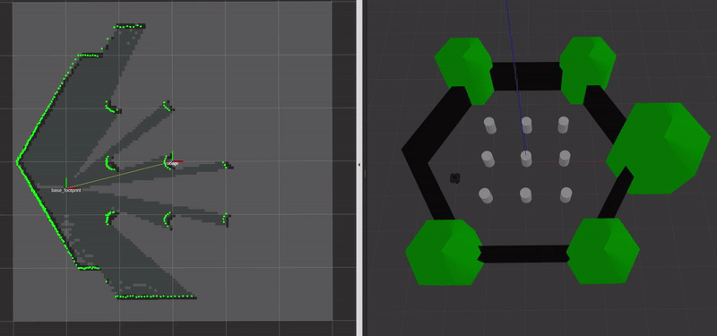

# TurtleBot3 - Gmapping
#### Chenge Yang, 2019 winter, Northwestern University

-----------------------------------------------------------------------------------------
## 1. Introduction
This project contains my own implementation from scratch of the classic Gmapping algorithm for Turtlebot3 in C++. It is integrated with ROS, and provides full visualization in Rviz.

It is part of my final project at Northwestern University, together with [Probabilistic-Robotics-Algorithms](https://github.com/ChengeYang/Probabilistic-Robotics-Algorithms).

#### Table of Contents
- [1. Introduction](#1-Introduction)
- [2. Setup](#2-Setup)
- [3. Project Structure](#3-Project-Structure)
  - [3.1. Folders](#31-Folders)
  - [3.2. Cpp Files](#32-Cpp-Files)
- [4. Algorithm](#4-Algorithm)
  - [4.1. Particle Filter](#41-Particle Filter)
  - [4.2. Motion Model](#42-Motion-Model)
  - [4.3. Measurement Model](#43-Measurement-Model)
  - [4.4. Scan Match](#44-Scan-Match)
  - [4.5. Map Update](#45-Map-Update)
  - [4.6. Resampling](#46-Resampling)
- [5. How to Run](#5-How-to-Run)
- [6. Demo](#6-Demo)
- [7. Future Work](#7-Future-Work)

-----------------------------------------------------------------------------------------
## 2. Setup

#### Turtlebot3 Setup
This project uses Turtlebot3 Waffle Pi. Please refer to [doc/turtlebot3_setup.md](doc/turtlebot3_setup.md).

#### PC Setup
* Ubuntu 18.04
* ROS Melodic

#### Dependencies
* [turtlebot3_description](http://wiki.ros.org/turtlebot3_description)
* [turtlebot3_gazebo](http://wiki.ros.org/turtlebot3_gazebo)
* [turtlebot3_teleop](http://wiki.ros.org/turtlebot3_teleop)
* [gmapping](http://wiki.ros.org/gmapping)
* [openslam_gmapping](http://wiki.ros.org/openslam_gmapping)
* [Eigen 3](https://eigen.tuxfamily.org/dox-devel/index.html)
* [Point Cloud Library (PCL)](http://pointclouds.org/)

-----------------------------------------------------------------------------------------
## 3. Project Structure
This project is formulated as a standard [ROS package](http://wiki.ros.org/Packages#Common_Files_and_Directories).

### 3.1. Folders
* [/doc](doc/): documents, figures, gifs, etc.
* [/include](include/): C++ header file.
* [/launch](launch/): ROS launch file.
* [/rviz](rviz/): Rviz config file.
* [/src](src/): C++ source file.

### 3.2. Cpp Files

#### Source file
* [main.cpp](src/main.cpp): C++ main function. Call class Gmapping.

#### Header file
* [gmapping.hpp](include/my_gmapping/gmapping.hpp): ROS interface node handling parameters, subscribers & publishers, callbacks, etc. Call class_manager.
* [class_manager.hpp](include/my_gmapping/class_manager.hpp): manager node to initialize and store all submodules.
* [transform_manager.hpp](include/my_gmapping/transform_manager.hpp): handles tf related functions.
* [particle_filter.hpp](include/my_gmapping/particle_filter.hpp): controls the overall workflow of Gmapping algorithm.
* [motion_model.hpp](include/my_gmapping/motion_model.hpp): contains odometry sensor and motion model function.
* [measurement_model.hpp](include/my_gmapping/measurement_model.hpp): contains Laser Scan sensor and measurement model functions.
* [scan_matcher.hpp](include/my_gmapping/scan_matcher.hpp): ICP-based scan matcher for 2D point cloud.
* [particle.hpp](include/my_gmapping/particle.hpp): Particle class to represent a single particle.
* [mapper.hpp](include/my_gmapping/mapper.hpp): Mapper class for Occupancy Grid mapping.
* [utils.hpp](include/my_gmapping/utils.hpp): useful utility functions.

-----------------------------------------------------------------------------------------
## 4. Algorithm
The overall algorithm is based on the following references:
* Sebastian Thrun's book **Probabilistic Robotics**
* Paper [Improved Techniques for Grid Mapping with Rao-Blackwellized Particle Filters](http://www2.informatik.uni-freiburg.de/~stachnis/pdf/grisetti07tro.pdf)

### 4.1. Particle Filter
I followed the algorithm exactly in [Improved Techniques for Grid Mapping with Rao-Blackwellized Particle Filters](http://www2.informatik.uni-freiburg.de/~stachnis/pdf/grisetti07tro.pdf). Please see Table **Algorithm 1 Improved RBPF for Map Learning**.

### 4.2. Motion Model
For Turtlebot3, the odometry data is published through tf in ROS. The control input is the difference between two consecutive tf transform.

Thus, I used the **Odometry Motion Model** in Probabilistic Robotics Chapter 5.4.
* For computing P(x<sub>t</sub> | u<sub>t</sub>, x<sub>t-1</sub>): Probabilistic Robotics Page 134, **Algorithm motion_model_odometry**.
* For sampling from Motion Model: Probabilistic Robotics Page 136, **Algorithm sample_motion_model_odometry**.

### 4.3. Measurement Model
I used the **Likelihood Fields for Rnage Finders** in Probabilistic Robotics Chapter 6.4.
* For computing P(z<sub>t</sub> | x<sub>t</sub>, m): Probabilistic Robotics Page 172, **Algorithm likelihood_field_range_finder_model**.

### 4.4. Scan Match
I implemented a basic ICP 2D scan matching algorithm using Eigen3 and PCL.

### 4.5. Map Update
For updating OccupancyGrid map, I applied Raycasting to get the free grids along the way and the occupied grid at laser hitting position.
* For finding free grid: [Bresenham's line algorithm](https://en.wikipedia.org/wiki/Bresenham%27s_line_algorithm).
* For updating OccupancyGrid map: Probabilistic Robotics Page 288, **Algorithm inverse_range_sensor_model**.

### 4.6. Resampling
Resampling is only conducted when the number of effective particles **N<sub>eff</sub>** drops below a given threshold.

-----------------------------------------------------------------------------------------
## 5. How to Run
To build the package in ROS:
```
$ cd your_catkin_workspace
$ catkin build
```

To run this package in simulation environment:
```
$ roscd my_gmapping
$ roslaunch my_gmapping simulation.launch
```

Also, you can modify `simulation.launch` to run specified packages.

-----------------------------------------------------------------------------------------
## 6. Demo
For now, my algorithm can only do odometry data based mapping. Although it already has the complete implementation of Gmapping algorithm, the measurement model and scan match modules are not working as expected, which may cause drifting and diverging errors.

The mapping demo is shown below (Left - Rviz; Right - Gazebo):

<p align = "center">
  
</p>

-----------------------------------------------------------------------------------------
## 7. Future Work
1. There exists a drifting between particle state and the tf transform. I will try to figure out the reason behind.
2. Motion model is not exactly following the one in the book currently. I will modify it to get better odometry estimate.
3. Measurement model is not working properly right now. I still need to figure out whether a likelihood field is computed for each particle map at each timestamp. If so, I will implement it.
4. The scan matcher seems to converge right now but can cause significant drifting error. Testing data and unit test should be created for it.
5. When every submodule works as expected, I will then combine them together, then maybe publish it as a ROS package.

-----------------------------------------------------------------------------------------
